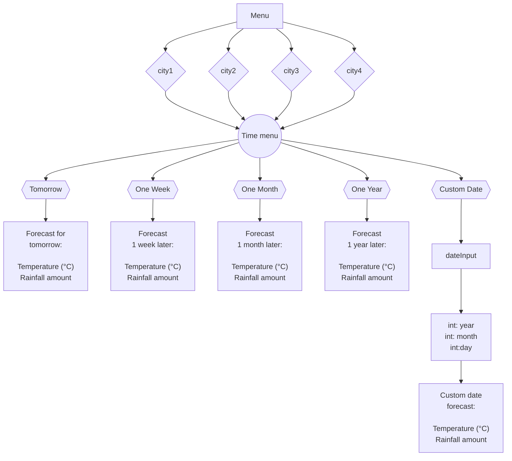

# Rendszerterv

## A Rendszer célja

A rendszer célja aktuális regionális időjárási adatok hozzáférésének biztosítása.
A felhasználónak lehetőséget ad bizonyos települések időjárási adatainak elmentésére.
A Weather webapplikáció célja az, hogy a felhasználók számára könnyen és gyorsan hozzáférhetővé tegye az időjárási információkat.

A webalkalmazás lehetővé teszi a felhasználók számára, hogy egyszerűen megkeressék a kívánt helyszínt a kereső funkció használatával, és biztosítja az időjárási adatok megjelenítését kártyák formájában.
Az első kártya kiemelt módon mutatja be az aktuális hőmérsékletet, míg a további kártya grafikusan ábrázolja a többi nap előrejelzését, segítve a felhasználókat a jövőbeli időjárás megértésében.

A webalkalmazás fókuszában a felhasználói élmény és az egyszerűség áll, így mindenki könnyedén
használhatja bármely platformon, legyen az számítógép, tablet vagy telefon.
Az ingyenes elérhetőség lehetővé teszi bárki számára, hogy naprakész időjárási adatokhoz jusson.
A webalkalmazás kártya alapú megjelenítésével a felhasználók gyorsan és könnyen áttekinthetik az időjárási információkat.

Előző alkalmazásunkkal összehasonlítva ez az alkalmazás egy TensorFlow megtanított modellt használ,
amely a jövőbeli időjárást is képes előre jelezni anélkül, hogy szükség lenne felállított időjáráselőrejlző
rendszerekre. A modell 120 évvel ezelőtti mindennapos időjárásadatokat tanult meg, és ezek alapján jelzi
előre a jövőbeli időjárást.

A rendszer célja aktuális regionális időjárási adatok hozzáférésének biztosítása
TensorFlow-ban implementált AI modell segítségével.
A felhasználónak lehetőséget ad bizonyos települések időjárási adatainak elmentésére.
A Weather webapplikáció célja az, hogy a felhasználók számára könnyen és gyorsan
hozzáférhetővé tegye az időjárási információkat.

A webalkalmazás lehetővé teszi a felhasználók számára, hogy egyszerűen megkeressék
a kívánt helyszínt a kereső funkció használatával, és biztosítja az időjárási adatok
megjelenítését kártyák formájában. Az első kártya a választható városokat tartalmazza.
Ezekre kattintva megnyílit az adott városnak specifikus oldal, ahol a következő kártyák jelennek meg:

- Holnapra jósolt adatok

- Jelenlegi naptól 7 napra eső napra jósolt adatok

- Jelenlegi naptól 30 napra eső napra jósolt adatok

- Jelenlegi naptól 365 napra eső napra jósolt adatok

- Részletes szűrés

A részletes szűrés kártyán a felhasználó rászűrhet a neki szükséges dátumra jósolt időjárási
adatokra egy külön oldalon.

A webalkalmazás fókuszában a felhasználói élmény és az egyszerűség áll, így mindenki
könnyedén használhatja bármely platformon, legyen az számítógép, tablet vagy telefon.
Az ingyenes elérhetőség lehetővé teszi bárki számára, hogy naprakész időjárási adatokhoz jusson.
A webalkalmazás kártya alapú megjelenítésével a felhasználók gyorsan és könnyen
áttekinthetik az időjárási információkat.

## Projektterv

### Projekt szerepkörök

| Név           |     Szerepkör      |                        Feladat |
|:--------------|:------------------:|-------------------------------:|
| Baráth Simon  | Software Engineer  |                     AI/Backend |
| Brázda Martin | Software Engineer  |                Backend/Teszter |
| Deák Erik     | Software Engineer  |                Frontend Stílus |
| Gyenes Balázs | Frontend developer | Frontend logika implementálása |

## Ütemterv

- Projekt kezdet: **2023. október**

- Követelményspecifikáció megfogalmazása: **2023. október**

- Funkcionális specifikáció megfogalmazása: **2023. október**

- Rendszerterv megfogalmazása: **2023. október**

- HTML és hozzá tartozó stíluslap elkészítése: TBA

- Frontend vezérlő elkészítése: TBA

- TensorFlow modell elkészítése: **2023. opktóber 26.**

- Endpointok létrehozása: TBA

- Backend - Frontend kommunikáció implementálása: TBA

| Funkció      | Feladat            | Prioritás | Becslés (h:mm) | Eltelt idő (h:mm) | Hátralévő idő (h:mm) |
|:-------------|:-------------------|:---------:|:--------------:|:-----------------:|:--------------------:|
| KövSpec      |                    |     6     |      2:00      |       2:00        |         0:00         |
| FunkSpec     |                    |     6     |      2:00      |       2:00        |         0:00         |
| Rendszerterv |                    |     6     |      2:00      |       1:00        |         1:00         |
| WebApp       | Frontend stílus    |     5     |      2:00      |       0:00        |         2:00         |
|              | Frontend vezérlés  |     5     |     10:00      |       0:00        |        10:00         |
|              | Frontend tesztelés |     5     |      2:00      |       0:00        |         2:00         |
| API          | Adatok beolvasása  |     3     |      4:00      |       0:00        |         4:00         |
| Backend      | TensorFlow modell  |     0     |     20:00      |       10:00       |        10:00         |
|              | Adatok elérése     |     2     |      8:00      |       0:00        |         8:00         |
|              | Backend tesztelés  |     2     |      5:00      |       0:00        |         5:00         |

## Mérfölkövek

1. Projekt kezdete - **_2023. október 9._**

2. Követelményspecifikáció megírása - **_2023. október 10._**

3. Funkcionális specifikiáció megírása - **_2023. október 19._**

## Üzleti folyamatok modellje

### Üzleti szereplők

1. Felhasználó: Az alacsony jogosultágokkal rendelkező felhasználó, aki használja az 
   alkalmazást az időjárás lekérdezéséhez.

2. Adminisztrátor: Adminisztrátorok magasabb jogosultsági szinttel rendelkező felhasználók 
   az alábbi feladatok ellátása végett:

   - Problémák kezelése: Jelenlegi problémák, panaszok, visszajelzések kezelése.

   - Renszerkarbantartás: Biztonsági mentések rendeltetés szerű készítése,
     a rendszer teljesítményének optimalizálása.

   - Kommunikáció: Rendszeres kommunikálás a felhasználókkal: válasz
     felhasználók kéréseire, kérdéseire.

### Üzleti folyamatok

0. **Backend API betaníttatása**: A háttéralkalmazás felkészítése a meglévő 
városok időjárásának lekérdezésére.

   - _Input_: Adatbázis az elmúlt 120 év időjárásadataiból

   - _Output_: nincs

   - _Szereplők_: TensorFlow API

1. **Város Lekérdezése:** Adott város időjárási adatainak lekérdezése.
Az eseményt az alkalmazás felhasználói felülete indítja.

   - _Input_: Felhasználói input

   - _Output_: Lekérdezni kívánt város időjárási adatai előrejósolva

   - _Szereplők_: Felhasználó

2. **Város input elküldése**: A felhasználó által küldött városnak a backend 
felé történő elküldése. Az eseményt az alkalmazás felhasználói felülete indítja.

   - _Input_: Felhasználói input

   - _Output_: Város input elküldve a backend felé

   - _Szereplők_: Felhasználó, frontend

3. **Város input feldolgozása**: A backend TensorFlow API által feldolgozott adatok
lekérdezése a kívánt időszakra vonatkozólag.

    - _Input_: Város input

    - _Output_: Város időjárásának előrejelzése

    - _Szereplők_: Backend

4. **Város időjárásának továbbküldése**: A backend továbbküldi a frontend felé a frontend által lekért
és backend által feldolgozott adatokat.

    - _Input_: Város időjárásának előrejelzése

    - _Output_: Város időjárásának továbbküldése

    - _Szereplők_: Backend, frontend

5. **Megkapott város időjárásának feldolgozása**: A frontend a backendtől kapott adatokat
feldolgozza és felhasználó által feldolgozható formátumban megjelenítik.

    - _Input_: Város időjárásának továbbküldése

    - _Output_: Város időjárásának megjelenítése

    - _Szereplők_: Frontend

## Követelmények

### Funkcionális követelmények

> ### Megtekinteni kivánt város adatainak megjelenítése
>
> _Röviden_: Az alkalmazásnak könnyen értelmezhető módon kell megjelenítenie az adatokat.
>
> Célunk, hogy minden felhasználó könnyen és akadálymentesen hozzáférjen az időjárási adatokhoz.

> ### Tetszőleges város adatainak lekérdezése
>
> _Röviden_: Az alkalmazásnak akadálymentes módszert kell adnia a felhasználónak az általa kiválasztott város időjárási adatainak megjelenítésére.
>
> Célunk, hogy minden felhasználó képes legyen váltogatni tetszőleges városok adatai között.

> ### Előrejelzés megjelenítése
>
> _Röviden_: Az alkalmazásunk a felhasználó által válaszott város elkövetkező öt napjának előrejelzését
> _kártyákban_ jeleníti meg, melyek egyesével fél másodperc késéssel jelennek meg a felhasználó
> számára.
>
> Célunk ezzel, hogy a felhasználó előre tudjon kalkulálni a terveivel, valamint a szép lassú megjelenítés
> célja, hogy a felhasználó ne kapjon információtúlterhelést.

> ### Geoadatlekérő API-jal történő kommunikáció
>
> _Röviden_: Az alkalmazásnak kommunikálni kell tudni az OpenWeatherMap GeoData API-jával
>
> Célunk ezzel, hogy tovább tudjuk szállítani a megkapott adatot az OpenWeatherMap
> FiveDaysForecast API-jával

> ### Előrejelzés API-jával történő kommunikáció
>
> _Röviden_: Az alkalmazásnak kommunikálnia kell tudni az OpenWeatherMap Five Days Forecast API-
> jával
>
> Célunk ezzel, hogy a kötelezően megadandó geodatból érkező _'lat'_ és _'lon'_ térképpozicionálással
> kapcsolatos változókból az előrejelzés API-jának küldött **GET** kérés testéből a válasz testében lévő
> válaszból kapott adattal tudjon dolgozni az alkalmazásunk, ezáltal a szükséges megjelenítés ellátható
> lesz azokkal

### Nemfunkcionális követelmények

> ### A webalkalmazás gyors és reszponzív működése.
>
> _Röviden_: Célunk, hogy az alkalmazásunk működése során semmilyen sebességi
> valamint eszközkülönbségi tényező ne folyásolja be a felhasználói élményt.
>
> ### Kompatibilitás különböző böngészőkkel.
>
> _Röviden_: Célunk, hogy a felhasználó az általa preferált böngészőben tőlünk függetlenül is futtatni tudja
> az alkalmazásunkat.

### Törvényi előírások, szabványok

- Adatvédelmi jogszabályok betartása.
- GDPR követelmények teljesítése.

## Funkcionális terv

### Rendszerszereplők

- Felhasználók: A rendszer végfelhasználói, akik használják az alkalmazást.

### Rendszer használati esetek és lefutásaik

#### Város keresése

- A felhasználó kiválasztja az elérhető város kártyák közül az egyiket.

- A felhasználó kiválasztja a neki szükséges dátumot.

- A rendszer lekéri a város időjárási adatait.

- Az adatok megjelenítése a felhasználónak.

### Határ osztályok

- Felhasználói felület: A webes alkalmazás felhasználói felülete.

- Backend API: Az időjárási adatok lekérdezéséért és feldolgozásáért felelős komponens.

### Menühierarchia



### Képernyőterv:

- Főmenü:

  - Város kártyák

- Város előrejelzéses almenü:

  - Időjárás előrejelzés kártyák 

## Rendszerarchitechtúra

Az alkalmazás a következő részekből fog állni:

- **Frontend:** Felhasználói felület, amely a böngészőben fut és lehetővé teszi a 
  felhasználók számára az időjárási adatok megtekintését és a városok keresését.

- **Backend:** Pythonban TensorFlow felhasználással írt időjáráselőrejelző AI modell.

- **Backend API:** Pythonban írt köztes felület mely az AI-backend és az Angular Frontend közötti
  kapcsolatot fogja létrehozni

## Felhasználói felület tervezési minták

### Főmenü:

- Az alkalmazás tartalmaz egy négyzetet, mely lila / kék _hideg_ színeket tartalmaz a felhasználó
  szeme biztonsága érdekében, továbbá lekerekített széleket, hogy ne tűnjenek annyira élesnek a 
  szélek.

- Ezen belül látható négy darab dinamikusan megjelenő szépen animált kártya, melyek tartalmazzák az
  elérhető városokat.

### Kiválasztott város almenü:

- Az alkalmazás hasonló módon az előzőhöz tartalmazni fog négy helyett öt dinamikusan megjelenő szépen animált kártya,
  melyek a következő kártyákat tartalmazzák:
  - A holnapi időjárás előrejelzését
  - Jelenlegi naptól 7 napra eső nap időjárás előrejelzését
  - Jelenlegi naptól 30 napra eső nap időjárás előrejelzését
  - Jelenlegi naptól 365 napra eső nap időjárás előrejelzését
  - Egyedi dátum input

## Tesztterv

A tesztelések célja a rendszer és komponensei megfelelő működésének ellenőrzése, vizsgálata. 
A tesztelések magukban foglalják a frontend és backend egységteszteket,valamint az
integrációs teszteket a rendszer egészének ellenőrzésére.

1. Tesztelendő funkciók:
   - Az inputként beadott város valóban a mellette megjelenő várost jeleníti-e meg

   - A keresőgomb valóban véghezviszi-e a tőle elvárt funkcionalitást

   - A kártyák adata valóban a **GET** kérésből származó adatot tartalmazza-e

   - Ténylegesen változik-e az újra lekért adat az előzőtől

2. Tesztek futtatása:
   - Minden tesztesetet végre kell hajtani a fejlesztés után és az alkalmazás kiadása előtt.

   - A tesztek függetlenek kell legyenek egymástól, és egymás után is futtathatók, hogy külön-

     külön és együtt is tesztelhessük a rendszert.

3. Teszteredmények Rögzítése:
   - A tesztek futtatása során rögzíteni kell az eredményeket, beleértve a sikeres és sikertelen

   teszteseteket is.

   - A hibákat és problémákat dokumentálni kell, hogy a fejlesztők kijavíthassák azokat.

4. Hibajavítás és Újraellenőrzés

   - A tesztek eredményeinek alapján a talált hibákat javítani kell, majd újraellenőrizni

   a rendszert a javítások után.

5. Elfogadási Teszt

   - Az elfogadási teszt során az alkalmazást a végfelhasználók (tanárok és diákok) is 
     
   tesztelik, és visszajelzéseik alapján lehetőség szerint további javításokat végeznek.

## Fizikai környezet

- Az alkalmazás kizárólag PC-ről és Mobilról használt webes felületre készül.

- Van tűzfal a hálózaton és minden portot engedélyez

- Nincs monetizált komponens

- Fejleszői eszközök:

   - [Jetbrains Intellij IDEA](https://www.jetbrains.com/idea)

   - [Jetbrains PyCharm](https://www.jetbrains.com/pycharm)

   - [Flask](https://flask.palletsprojects.com)

   - [Visual Studio Code](https://code.visualstudio.com)

   - [Paint.NET](https://getpaint.net)

   - [Node.JS](https://nodejs.org)

   - [Angular 14](https://angular.io)

## Absztrakt domain modell

Az alkalmazás absztrakt domain modelljének leírása.

- Felhasználók: A rendszerben regisztrált felhasználók.

- Városok: Az alkalmazás által kezelt városok és az azokhoz tartozó időjárási adatok.

- Dátum: A városokhoz külön kezelt adat.

- Adminisztrátorok: Az adminisztrátori jogosultsággal rendelkező felhasználók.

## Implementációs terv

A webes felület HTML, CSS és TypeScript nyelveken fog elkészülni a. A rendszer fájlrendszere jelentősen szét lesz szórva az egyszerűbb kiegészítés és a könnyebb értelmezés 
végett.

A webes felület elkészítése HTML, CSS, JavaScript és TypeScript nyelveken történik, az Angular keretrendszer
segítségével. A kódot több különálló fájlban készítjük el, hogy növeljük az átláthatóságot és a könnyebb
fejlesztést. A HTML felel a felület struktúrájáért, a CSS a stílusért, míg a JavaScript és TypeScript a dinamikus
funkcionalitásért.

A backend implementálása Python nyelven lesz kivitelezve a TensorFlow könyvtár felhasználásával.

A backend API implementálása Python nyelven fog történni a Flask webes keretrendszer segítségével.

## Telepítési terv

- Le kell tölteni a NodeJS-t: *https://nodejs.org/en*

- Fel kell telepíteni az Angular CLI-t egy konzolparanccsal

```bash
npm install -g @angular/cli
```

- Le kell tölteni a projekt megfelelő mappáját

  *https://github.com/Exanim/TensorFlow-Weather-Prediction*

- Konzollal belenavigálva elindítható az alkalmazás 

```bash
npm start
```

- Webes alkalmazás: Az alkalmazás megtekintéséhez szükséges **egy** az ajánlott böngészők közül:

  - [Google Chrome](https://www.google.com/chrome)
  - [Mozilla Firefox](https://www.mozilla.org/en-US/firefox/)
  - [Opera](https://www.opera.com)