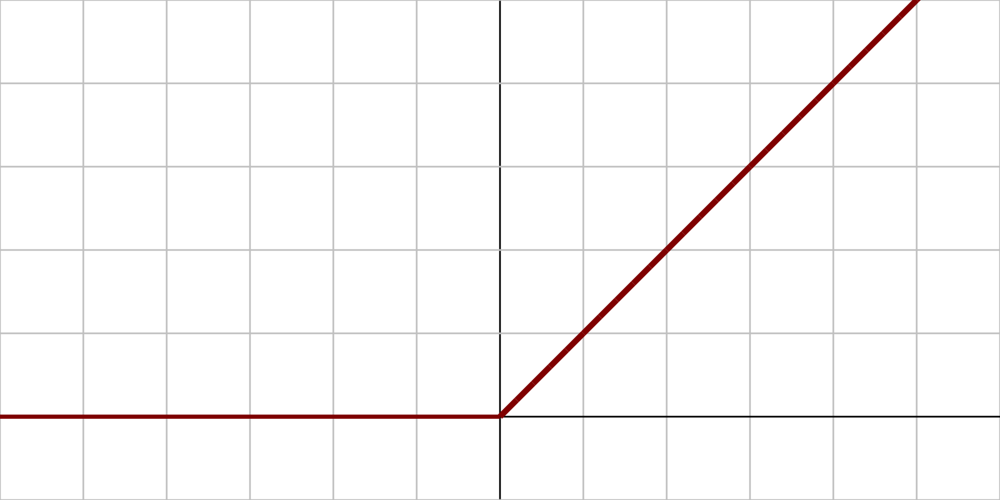
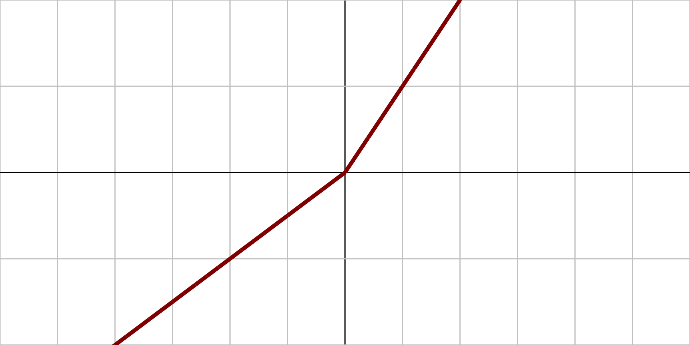
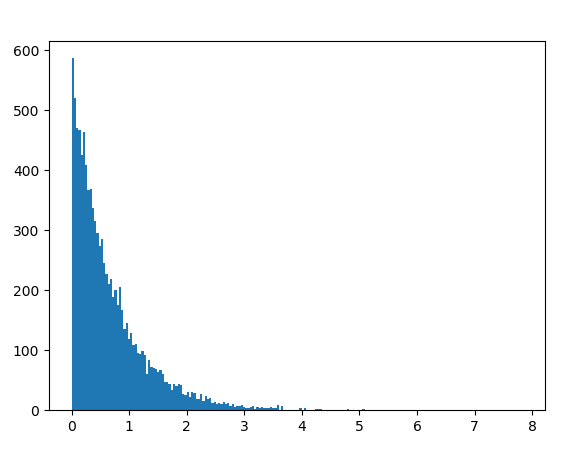

## A jó modell nyomában

Az első modell az egy egyszerű sklearn modell volt, ami még nem egy neurális háló. Csak standardizált adatokkal, nem konfigurált hyperparaméterekkel egy RandomForestRegression.

Az első változtatás az az volt, hogy váltottunk a tensorflow neural networkre a pontosabb eredményekért, de ez a komplexitást megugratta és hirtelen sok szempontot kellett figyelembe venni hogy egyáltalán elérjük azt a szintet amit az sklearn modell produkált.

Szóba jött hogy ket külön modellt használunk a hőmérsékletre és a napi összes esőre, hogy a kiszámíthatatlanabb esőn való tanulást elkülönítve tudjuk személyre szabni, de végül nem emellett döntöttünk. Részben azért, mert nem függetlenek.

year_ignore_model: A legjobb eredményeket akkor kaptuk ha az évet úgy ahogy van kivesszük az adathalmazból amit a tanuláshoz használ a modell és hagyjuk hogy jójjon ra az évszakok okozta változásokra. Azonban az esőre vonatkozó értékeket még mindig nagyon reménytelenül tulatlágolja meg dropout layerek használatával is (amik a tanulás egy részét elfelejtetik, hogy legyen lehetősége a modelnek új szabályszerűségekre rájönnie). 1.6 és 1.4 milliméter közötti értékeket ad csak vissza minden napra. 

tervezett megoldások: 
- évszám és a hőmérséklet közötti kapcsolata 1980 felett: a * log(évszám) + eredeti eredmény = hőmérséklet
- az eső értékeket egy radikalizáló függvénnyel jobban szétszórjuk és lekerekitjük, majd levágjuk az alacsony értékeket nullára

year_ignore_model továbbgondolása: Számos próbálkozás a dropout layerek kihasználására kudarcba fulladt és egy új aktivációs függvényre fordult a figyelmünk. A PReLU egy paraméteres változata a RELU függvénynek amit eddig használtunk, és annak reményében váltottunk rá, hogy tanítható paramétere miatt pontosabb eredményeket kapunk.

Az így kapott modell egy gyorsan konvergált. Mindossze 20 epoch alatt elért egy mérhetően jobb összetett hibaértéket.

RELU:
 

PReLU:

## Post Processing

### Hőmérséklet

> Az adatban szereplő évek 150 évre nyúlnak vissza, de a globális
> felmelegedési rátát (ami évtizedenként 0.08 °C 1880 óta, és több mint
> kétszer annyi, 0.18°C 1981 óta) is figyelembe kell venni, ha nagyobb
> évszámokra akarunk lekérdezést indítani.  Mar amennyire ezt lehetséges
> előrejelezni egy egyszerű függvénnyel.
forras: https://www.ncei.noaa.gov/access/monitoring/monthly-report/global/202213

Végül habár a modell figyelmen kívül hagyja az évszámot amikor megjósolja a hőmérsékletet, 1981 után kap egy apró összeget évtizedenként. Ez az összeg a log() függvénnyel le lett laposítva nagyobb évszámokra való tekintettel.

### Csapadék

> Hosszás próbálkozások után se sikerült elkerülni hogy a modell ne csak
> a legkisebb hibát eredményező nagyon kis szórásu eves atlagcsapadekot
> josolja minden lekérdezett napra. Ez a gyakorlatba mindig 1.8 és 2.0
> között mozgott.

Ezért a csapadék előrejelzésére egy teljesen modelltol független random generatorfuggvény került felhasznalasra.
Ez a generator függveny 0.0-k sorait megtorve ad vissza [0;25] tartományban számokat ahol a nagyobb számra kevesebb az esély

expovariate eloszlas:

